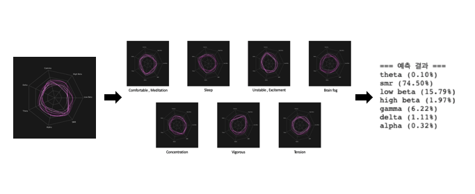

## EEG-Tensorflow

* EEG image matching file using inception
* eeg.ipynb : Used colab's virtual gpu computer
* https://steemit.com/kr/@deep-root/research-tips-colaboratory-colab

#### Screenshot
* result

